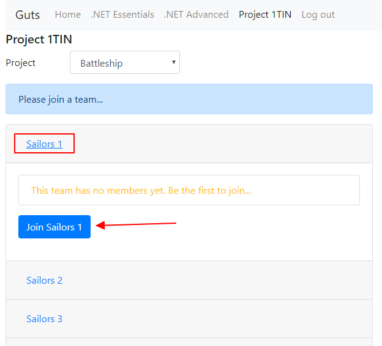

De code van de backend is vergezeld van automatische testen die de oplossing controleren. 
Om aan de slag te kunnen gaan, lees je eerst de [handleiding voor het aanmaken en clonen van je team repository](Git).

## Registratie en aansluiten bij een team

Een deel van het cijfer zal gebaseerd worden op het aantal automatische testen die het team groen krijgt.
Daarom werken we voor de backend met het GUTS systeem (Growing towards a Unit Testing Strategy). 

Om je resultaten door te kunnen sturen moeten alle teamleden geregistreerd zijn bij [guts-web.pxl.be](https://guts-web.pxl.be). 

Daarna moet je jezelf associėren met een team. 
Meld je aan op [guts-web.pxl.be](https://guts-web.pxl.be) en klik bovenaan in het menu op *Project 1TIN*.
Zoek het team met jouw teamnummer en sluit je aan bij het team:

## Automatische testen uitvoeren

1. Build de solution
2. Open het *Test Explorer* venster (Menu: *Test -> Windows -> TestExplorer*)
3. Klik op de _groepeerknop_ boven in het venster. Groepeer de testen op _Project_ en dan _Class_.

5. Klik rechts op de klasse waarvoor je de testen wil uitvoeren en klik op *Run selected tests*
6. De eerste keer wanneer je testen uitvoert, zal er een browservenster opgengaan waarin je gebruikersnaam en wachtwoord moet invullen (de account waarmee je geregistreerd bent op [guts-web.pxl.be](https://guts-web.pxl.be). Na het aanmelden zullen de resultaten doorgestuurd worden door Visual Studio.

De resultaten kan je nu ook raadplegen via [guts-web.pxl.be](https://guts-web.pxl.be).

##### FAQ: Mijn testresultaten worden niet doorgestuurd naar de guts website. Hoe komt dit?

Nadat de testen zijn uitgevoerd zal de testrunner de resultaten proberen door te sturen naar de guts applicatie. 
In het *Output* venster kan je een log lezen van de stappen die de testrunner onderneemt. 
Als er iets mis gaat, dan zou je meer informatie moeten vinden in het *Output* venster.

Enkele veel voorkomende oorzaken:
* Testresultaten worden enkel doorgestuurd als je alle testen van een klasse uitvoert. Als je slechts 1 of enkele testen van een klasse uitvoert, dan wordt er niets doorgestuurd.
* Bij de minste wijziging aan de testcode zal het je niet meer lukken om resultaten door te sturen (omdat de hash van de testcode niet meer klopt). Maak wijzigingen aan code in de testprojecten ongedaan en probeer opnieuw. 

##### De testen verhinderen me om een uitbreiding te implementeren. Wat nu?

Als je een uitbreiding implementeert, dan is het mogelijk dat er automatische testen die voordien groen waren nu opeens rood worden. 
Het zou zelfs kunnen dat bepaalde testcode niet meer compileert. Testcode mag niet aangepast worden.

De code is zo gestructureerd dat het mogelijk moet zijn om uitbreidingen toe te voegen zonder de bestaande testcode te wijzigen.
Vraag raad aan de lectoren als je geen manier kan bedenken om een uitbreiding te doen zonder bestaande code te breken.

## Evaluatie

De automatische testen zijn er vooral om te controleren of je team de basisvereisten heeft geļmplementeerd. 
Heb je alle testen groen dan weet je dat je geslaagd zal zijn op het backend gedeelte.

Uiterraard zal een groot gedeelte van de punten nog steeds afhangen van de presentatie / demo.
Tijdens de presentatie laat je een werkende frontend zien. 
Je toont aan dat de basisvereisten er zijn en je laat zien welke extra functionaliteiten je hebt geļmplementeerd.

#### Fraude

Mogelijks zal de verleiding groot zijn om code te "lenen" van andere teams. 
Zowel het kopiėren als geven van code wordt als **examenfraude** beschouwd en zal in bijna alle gevallen leiden tot een **0 voor dit vak**. 

Hou in het achterhoofd dat samen met de testresultaten ook je code naar het guts-systeem gestuurd wordt. 
**Het guts-systeem heeft een ingebakken functionaliteit die plagiaat kan opsporen!**
