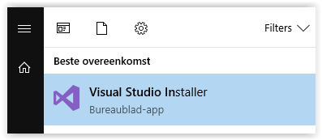

## Algemeen

De backend is een webapplicatie waarmee je via het HTTP(S) protocol kan communiceren. Als je de applicatie start dan kan je HTTP requesten sturen naar https://localhost:5001.
De backend maakt gebruik van het .NET Core MVC framework. Dit framework zal pas later in de opleiding aan bod komen. Daarom hebben we alles wat met het MVC framework te maken heeft, reeds geïmplementeerd.
Er zitten echter wel (heel wat) gaten in de code. Deze gaten zal je met je kennis uit .NET Essentials moeten opvullen.

## Installatie

Om een .NET Core webapplicatie te kunnen bouwen moeten de nodige componenten in Visual Studio geïnstalleerd worden.

* Klik op de windows knop en zoek naar Visual Studio Installer. Start het programma.

* Als er een update beschikbaar is, update Visual Studio naar de laaste versie. (Op het moment van schrijven is dit versie 15.9.10). Let op: dit kan gemakkelijk een half uur duren!
* Klik op de _Modify_ knop
* Zorg dat de minstens de volgende Workloads aangevinkt zijn:
     * .NET desktop development
     * ASP.NET and web development
     * Data storage and processing

TODO: image

* Klik rechts onder op de knop om de wijzigingen door te voeren.
* Surf naar https://dotnet.microsoft.com/download en installeer de .NET Core 3.1 **SDK**. Let op: kies voor de **SDK** niet de _Runtime_.

TODO: image

## Projectstructuur

TODO: image

In de solution vind je 9 projecten:

* Battleship.Api -> Dit project is de eigenlijke webapplicatie. 
In de Controller folder vind je enkele classes die methoden bevatten die uitgevoerd worden als er een http request binnenkomt op een bepaalde url. 
Om de minimale vereisten te implementeren is het niet nodig om hier 1 letter code te wijzigen. 
Het gaat wel handig zijn om hier breakpoints te plaatsen om je applicatie te debuggen.
* Battleship.Api.Tests -> Bevat automatische testen voor de Controller classes in het Battleship.Api project. 
Deze testen zijn initieel allemaal groen. Aan jullie om dit zo te houden!
* Battleship.Business -> Bevat enkele service classes die gebruikt worden door de Controller classes in het Battleship.Api project. 
Hierin zal je enkele gaten moeten invullen.
* Battleship.Business.tests -> Bevat automatische testen voor de classes in het Battleship.Business project. 
Gebruik (naast de documentatie) deze testen om te achterhalen hoe je deze classes het best implementeert.
* Battleship.Data -> Bevat logica die toelaat om data op te slaan in een database of in geheugen. 
Voor deze applicatie worden gebruikers (spelers) opgeslagen in een database. 
Hiervoor moet je geen code schrijven. 
Ook is er een Repository class waarmee de lopende games in geheugen bijgehouden worden. 
Je hoeft geen code te wijzigen in deze class, maar het is niet slecht om de interne werking van _InMemoryGameRepository_ eens te bestuderen.
* Battleship.Data.tests -> Bevat automatische testen voor de classes in het Battleship.Data project. 
Jij moet enkel ervoor zorgen dat deze testen groen blijven.
* Battleship.Domain -> Bevat de domain classes. Deze classes proberen de logica van een zeeslag-spel te capteren. Hier zitten de grootste gaten die je zal moeten opvullen.
* Battleship.Domain.Tests -> Bevat automatische testen voor de classes in het Battleship.Domain project. 
Gebruik (naast de documentatie) deze testen om te achterhalen hoe je deze classes het best implementeert.
* Battleship.TestTools -> Bevat enkele classes die gebruikt worden door de testprojecten. Dit project mag je volledig negeren.

