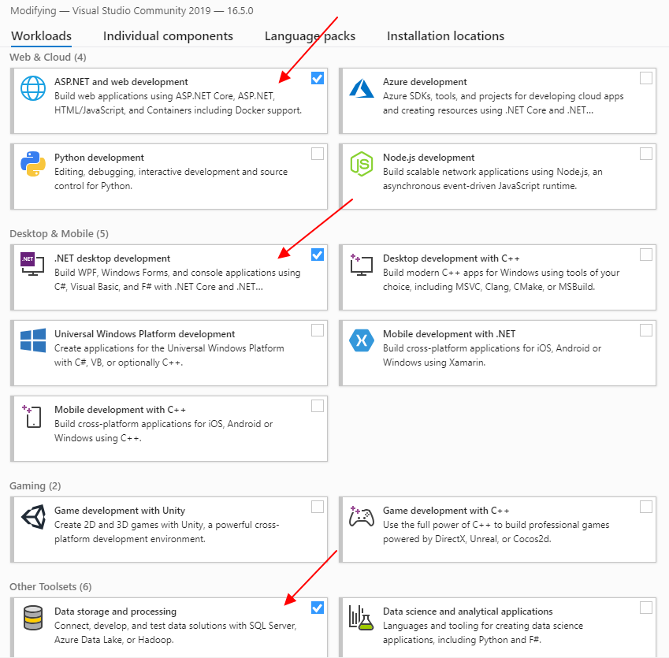
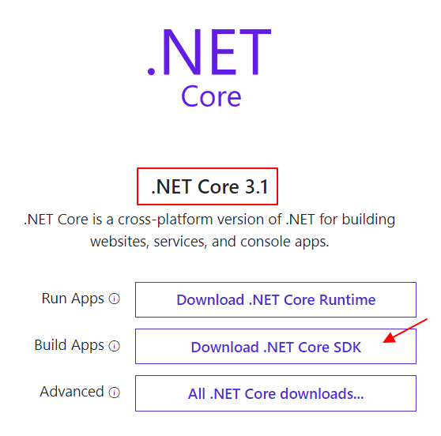

## Algemeen

De backend is een webapplicatie waarmee je via het HTTP(S) protocol kan communiceren. Als je de applicatie start dan kan je HTTP requesten sturen naar https://localhost:5001.
De backend maakt gebruik van het .NET Core MVC framework. Dit framework zal pas later in de opleiding aan bod komen. Daarom hebben we alles wat met het MVC framework te maken heeft, reeds geïmplementeerd.
Er zitten echter wel (heel wat) gaten in de code. Deze gaten zal je met je kennis uit .NET Essentials moeten opvullen.

## Installatie

Om een .NET Core webapplicatie te kunnen bouwen moeten de nodige componenten in Visual Studio geïnstalleerd worden.

* Klik op de windows knop en zoek naar Visual Studio Installer. Start het programma.

* Als er een update beschikbaar is, update Visual Studio naar de laaste versie. (Op het moment van schrijven is dit versie 16.5.0). Let op: dit kan gemakkelijk een half uur duren!
* Klik op de _Modify_ knop
* Zorg dat de minstens de volgende Workloads aangevinkt zijn:
     * .NET desktop development
     * ASP.NET and web development
     * Data storage and processing

* Klik rechts onder op de knop om de wijzigingen door te voeren.
* Surf naar https://dotnet.microsoft.com/download en installeer de .NET Core 3.1 **SDK**. Let op: kies voor de **SDK** niet de _Runtime_.

## Automatische testen

Voor de backend code is er voor de minimale vereisten ondersteuning van automatische testen met het Guts-systeem.

Een deel van de punten zal hier ook aan gekoppeld worden.
Neem daarom zeker ook de [handleiding rond ondersteuning van automatische testen](Automatische-testen) eens door.

## Project structuur

De [pagina over de structuur van het project](Project-structuur) zal je meer concreet toelichten hoe de code in elkaar zit en waar je de gaten moet opvullen. 

