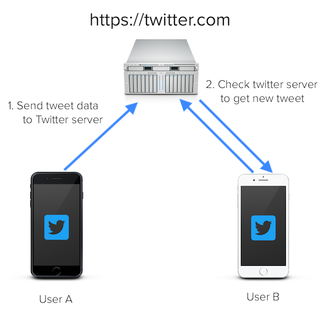
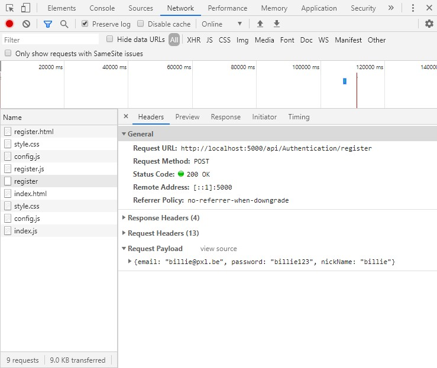
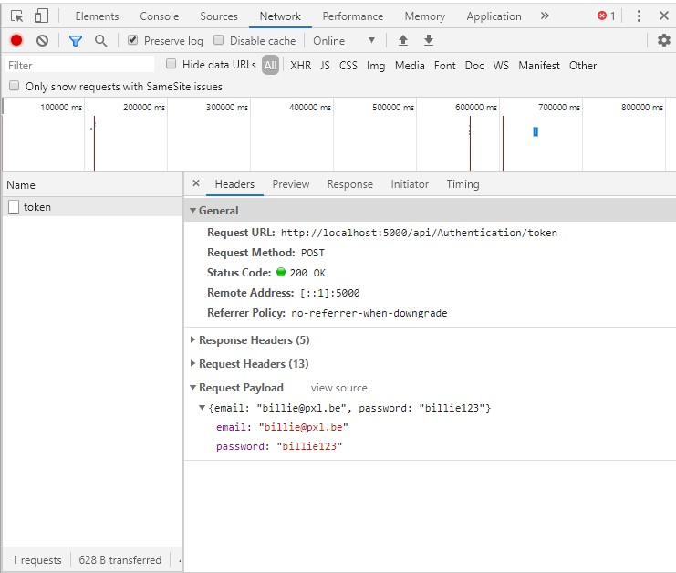
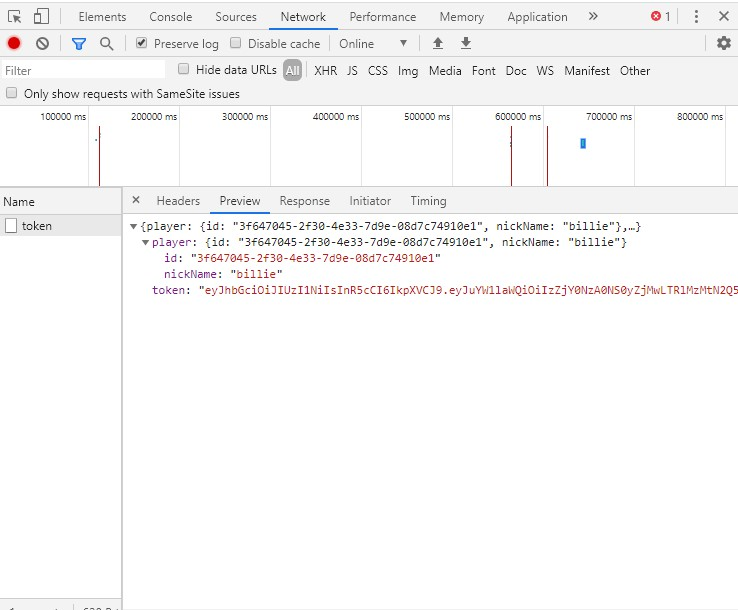
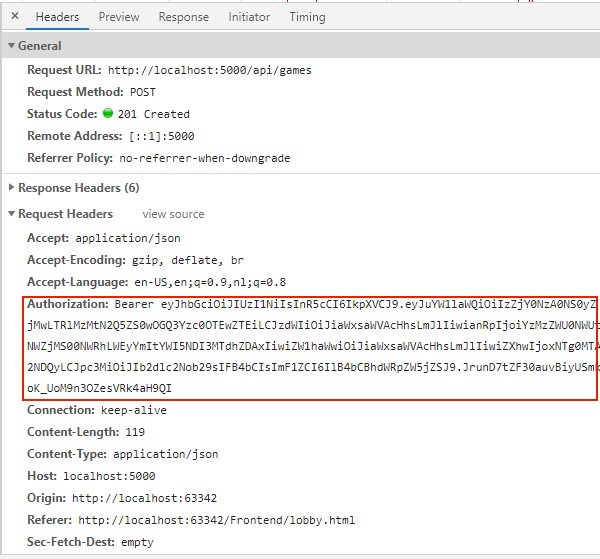

# Client-Server architectuur

Wanneer je een Twitter(of Instagram)-bericht de wereld instuurt, dan zal de app (op je telefoon of laptop) dit bericht versturen naar de Twitter server. Jouw volgers vragen de twitter server om de nieuwe berichten te tonen.




Het is de taak van de server om jouw bericht op te slaan en toegankelijk te maken voor anderen. 

Gelijkaardig aan Twitter, gaat onze toepassing een server en een client gedeelte hebben. Het server gedeelte bevat de code om alle vragen (requests) van onze client, een website, te behandelen. Sommige gegevens, zoals geregistreerde spelers, worden door de server opgeslaan/geladen in een databank. Andere gegevens, zoals de gestartte spelletjes en de positie van de schepen, houdt de server bij in het geheugen terwijl de deze actief is. Dit betekent dat gebruikers wel gekend blijven als je de server herstart, maar de gegevens van de spelletjes gaan verloren bij een herstart. 

Met de term **backend** bedoelen we de server van onze toepassing. Deze term slaat op het feit dat de gebruiker niet (rechtstreeks) in aanraking komt met dit gedeelte van onze toepassing.

Aan de andere kant hebben we de **frontend** (of client side). Dit is wat de gebruiker ziet. Onze toepassing bevat HTML webpagina's die de gebruiker opent in zijn browser. 

Voor onze toepassing gebruiken we verschillende programmeertalen. Zo gebruiken we C# om de backend te ontwikkelen en HTML5, JavaScript en CSS om de frontend te bouwen.

# REST endpoints

De frontend kan met de backend communiceren omdat de backend een RESTfull API aanbiedt.  De backend heeft namelijk een aantal URL's ter beschikking voor de frontend. Een URL is bijvoorbeeld

**REST** staat voor  “Representational State Transfer”. Een van de regels om een RESTfull API aan te bieden is dat de client gegevens krijgt (dit deeltje gegevens noemen we een resource) wanneer hij een bepaalde URL (Uniform Resource Locator) aanroept. 

Iedere aanroep van een URL noemen we een **request** en de data die de client krijgt noemen we het **response**. In onze toepassing maken we gebruik van JSON (JavaScript Object Notation) om gegevens van en naar de server te versturen.


Wanneer je dus een request verstuurt naar de server moeten er 2 stukjes informatie minimaal aanwezig zijn in je request.  

1. Een identificatie van de resource waarin je geïnteresseerd bent. Dit is met andere woorden de URL van resource, ook wel het **endpoint** genoemd.
2. De operatie die je op de resource wilt uitvoeren in de vorm van een **HTTP method**. De meestgebruikt HTTP methods zijn GET, POST, PUT en DELETE.

Het HTTP response bevat steeds een **status code** die aangeeft hoe de server je vraag heeft kunnen afhandelen. Ging alles goed, dan ontvang je status **200** en je antwoord in JSON formaat. Heb je de server gevraagd om een nieuwe resource aan te maken dan krijg je een status code **201** indien dit correct is verlopen.  Status code **400** (Bad request) betekent dat de server je request niet wil of kan uitvoeren. Status code **403** (Forbidden) zal je krijgen als je geen toegang krijgt tot de resource (lees ook Security: bearer tokens). Status code **401** (Unauthorized) krijg je bijv. als je speler niet kan inloggen.  Status code 404 (Not Found) zal de server geven als de gevraagde resource niet bestaat. In de meeste gevallen zal ook bij een status code 40x het response extra informatie in JSON-formaat bevatten.  


# Security: bearer tokens

Als je aan de receptie van een hotel aankomt dan moet je eerst je identiteit bewijzen (dmv je identiteitskaart) en vervolgens krijg je een key card die je toegang geeft tot je hotelkamer.


Hetzelfde principe wordt gehanteerd voor het beveiliging van de backend. Wanneer een gebruiker van de frontend toegang wil krijgen tot de backend moet hij eerst zijn identiteit bewijzen en vervolgens krijgt hij van de backend een token waarmee hem verdere toegang tot de backend wordt verleend. Dit token noemen we een bearer token. De drager (bearer) van het token krijgt toegang tot de backend.

Een speler zal zich dus eerst moeten registeren. Dit kan natuurlijk zonder beveiliging gebeuren. Om een speler te registeren is het REST endpoint /api/Authentication/register voorzien.



Eens een speler geregisteerd is kan hij inloggen en een token aanvragen. Hiervoor is het REST endpoint /api/Authentication/token.



Het response (in json formaat) dat je terugkrijgt van de server bevat de id en nickName van de speler en het (bearer) token. 



Wanneer je eenmaal een bearer token hebt bekomen, kan je de andere REST endpoints gebruiken om bijv. een spel te starten, een schip te plaatsen,… Je moet je bearer token dan meegeven in de Authorization request header. Hieronder zie je het request om een spel te starten. 




Als je gebruikmaakt van fetch om in javascript de REST endpoints aan te spreken kan je het bearer token opslaan in sessionStorage. Hieronder zie je de aanmaak van een fetch-commando met Bearer token. 

```javascript
fetch(url,
{
  method:"POST",
  body: JSON.stringify(myData),
  headers:{
    'Accept':'application/json',
    'Content-Type':'application/json',
    'Authorization':'Bearer' + sessionStorage.getItem("token")
  }
})
```

