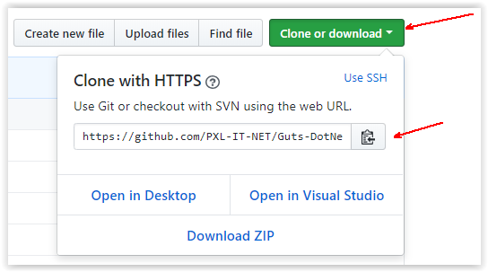
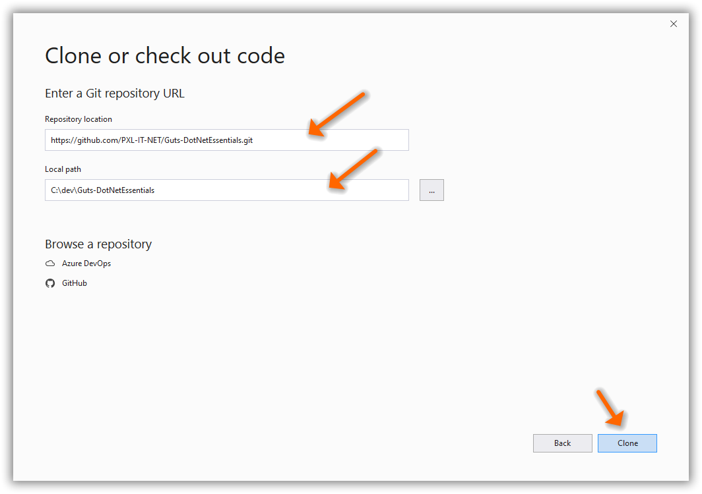
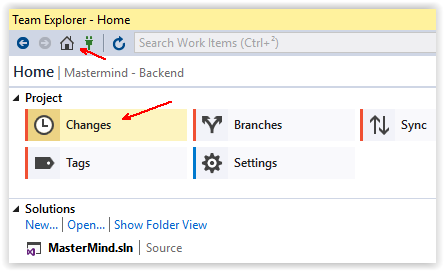
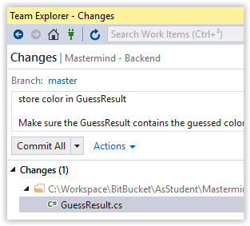
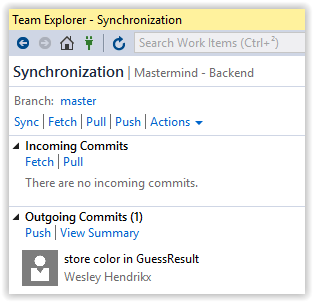
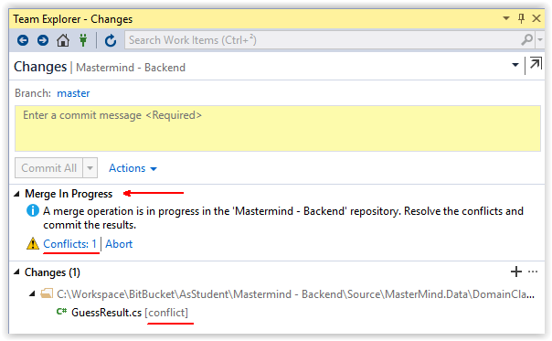
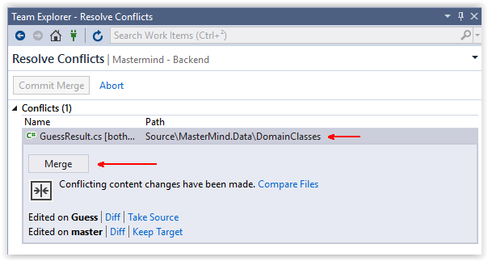
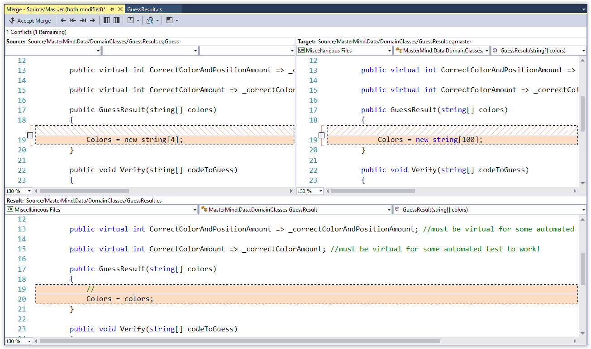
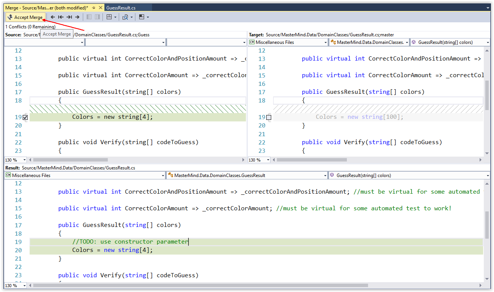
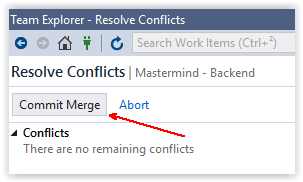

## Algemeen

Werken met git is een belangrijk onderdeel van het project. 
Als je de basisconcepten van git nog niet goed begrijpt, bekijk dan zeker eens het volgend materiaal:

* Pluralsight
     * [Basisconcepten van Git](https://www.pluralsight.com/courses/code-school-git-real)
     * [Hoe werkt Git onder de motorkap?](https://www.pluralsight.com/courses/how-git-works)
* [Git cheat sheet](https://education.github.com/git-cheat-sheet-education.pdf)

## Getting started

Voor dit project zal er gewerkt worden met GitHub Classroom. Het idee is dat je een online kopie neemt van de repository van de lectoren (die de startcode bevat). Enkel jouw team zal toegang hebben tot deze repository.

Om verder te kunnen gaan heb je een github account nodig. Als je er nog geen hebt, ga dan naar [https://github.com](https://github.com) en registreer je.

### Voeg je bij een team

Jouw lector zal je een teamnaam toewijzen. Deze zal de vorm _Sailors[nn]_ hebben waarbij _[nn]_ een volgnummer is. Bijvoorbeeld: _Sailors04_.

Als je een teamnaam hebt gekregen ga je naar de volgende url: [https://classroom.github.com/g/W4a9HA_H](https://classroom.github.com/g/W4a9HA_H)

Op deze pagina heb je twee mogelijkheden:
* 'Join' een team dat al bestaat (een ander teamlid heeft het team al aangemaakt)
* Maak zelf een nieuw team aan als jij het eerste teamlid bent. Gebruik _Sailors[nn]_ als naam (vervang _[nn]_ door je teamnummer.

Spreek goed af wie het team aanmaakt. Probeer dubbele teams te vermijden.

Teams die niet voldoen aan de juiste naamgeving worden verwijderd.

Voor elk team wordt er (automatisch) een **online** kopie gemaakt van deze repository. 

GitHub Classroom zal je de url van je team repository (je online kopie) tonen.
Deze zal volgende vorm hebben: _https://github.com/pxlit-projects/battleship-sailors[nn]_ waabij _[nn]_ je teamnummer is.
Surf naar deze url en sla hem op in je favorieten.

De volgende stap is om een **lokale** kopie (clone) te maken van de repository van je team.

## Clone je team repository

In deze handleiding tonen we hoe je Visual Studio kan gebruiken om met git te werken. Je bent echter vrij om je eigen favoriete git tool te gebruiken (command line, GitHub Desktop, ...).

* Start Visual Studio en selecteer "Clone or check out code".
* Surf met een browser naar de repository **van je team** en klik op de _Clone or download_ knop bovenaan rechts.
* Kopieer de url van je repository

* Plak de url in Visual Studio in het veld "Repository Location".
* Kies een lokaal pad. Dit is de folder waarin de bestanden van de repository gekopieerd zullen worden.
* Klik op de _Clone_ knop.

Nu heb je een lokale kopie van de online team repository en kan je aan de frontend en backend beginnen werken.

# Aan de slag
Om functionaliteit toe te voegen aan de frontend of backend open je de gewenste bestanden in je favoriete tool. 
Voor de frontend kan dit WebStorm zijn. Voor de backend open je het .sln bestand (solution) in Visual Studio.

Je kan bestanden toevoegen, wijzigen of wissen. 
Git zal automatisch detecteren welke bestanden gewijzigd, toegevoegd of gewist zijn.

In git werkt ieder teamlid aan zijn eigen lokale kopie van de code.
Als je klaar bent met een stuk code, dan deel je deze code best met je teamgenoten. 
Hiervoor doorloop je 3 stappen:

1. Maak een **lokale commit** (een lokaal restore point) waarin je wijzigingen vervat zitten.
2. Voeg deze commit toe aan de online versie van de code door een **push** te doen naar de **remote** *repository*.
3. Vraag aan je teamgenoten om de nieuwe versie van de code binnen te halen door ze een **pull** te laten doen.

Waar nodig gaat git code van jou automatisch samenvoegen met de code van anderen (**merge commit**). 
Als dat niet automatisch lukt, dan is er een **merge conflict** (bijvoorbeeld als je met 2 hetzelfde bestand hebt aangepast). 
In dat geval zal je de conflichten manueel moeten oplossen vooraleer de *merge commit* gemaakt kan worden. Dit wordt verderop meer toegelicht.

## Commits
Zorg dat je start met de laatste versie van de code (zie *Pull*) en begin te werken aan de code. 
Zodra je een werkend geheel hebt kan je beslissen om je code te delen met je teamgenoten. 
Een eerste stap hierin is het maken van een commit die je wijzigingen bevat:

* Ga naar *Team Explorer*
* Klik op de *Home* knop bovenaan en dan op *Changes* om te inspecteren welke veranderingen je hebt gedaan.

* Hier kan je eventueel controleren wat er allemaal gewijzigd is. Als je dubbelklikt op een bestand dan krijg je de verschillen met de vorige versie te zien.
* Elke commit heeft een omschrijving. Vul minstens 1 regel in die samenvat wat er (functioneel) gewijzigd is. Eventueel voeg je nog een lege regel toe gevolgd door een meer uitgebreide omschrijving.
* Klik op *Commit All* om de wijzigingen lokaal vast te leggen in een commit.

Als je een commit hebt gemaakt, dan wil dat nog niet zeggen dat je teamgenoten deze code ook hebben. 
Om daarvoor te zorgen, moet je eerst je lokale commit met een *push* toevoegen aan de online code in GitHub (*remote* repository).

## Synchronisatie
Synchronisatie bestaat uit 2 delen:

* Enerzijds ga je code (commits) van anderen binnenhalen (**= Pull**).
* Anderzijds ga je je eigen code (commits) toevoegen aan de remote code (**= Push**)

Synchroniseren doe je via het *Sync* scherm:

* Ga naar *Team Explorer*
* Klik op de *Home* knop bovenaan en dan op *Sync* om te synchroniseren met de remote repository.

### Pull
Een pull omvat eigenlijk 2 acties:

1. Download alle nieuwe commits van de remote repository (**=fetch**)
2. Als er een lokale commit is, voeg deze dan samen met de laatste commit van de remote repository in een nieuwe *merge commit* (**=merge**) 

Als je enkel wil kijken of er wijzigingen van teamgenoten zijn, dan klik je op *fetch*. 
Als je de wijzigingen ook onmiddellijk wil samenvoegen met je lokale commits dan klik je op *Pull*.

**Let op: lokale wijzigingen die niet in een commit zitten, gaan bij een *Pull* verloren!!!** Sla je lokale wijzigingen eerst op in een commit.

Doe regelmatig een pull. Om zo de kans op conflicten bij het mergen te minimaliseren.

### Push
Klik op *Push* om de commits die je lokaal hebt staan toe te voegen aan de remote repository (*origin*). 
De *origin* is de online kopie van de code in GitHub. 

Doe regelmatig een push en laat je teamgenoten weten dat er wijzigingen zijn zodat zij een pull kunnen doen.
**Hoe langer je wacht met het pushen van je code, hoe groter de kans is op merge conflicten!**

### Merge conflicten

Als een lokale commit en een remote commit samengevoegd worden (merge) dan kunnen er zich conflicten voordoen als beide commits wijzigingen doen op dezelfde plaatsen. 

In dat geval klik je op de *Conflicts* link:

Je krijgt dan een overzicht van de bestanden waar er een conflict is.
Klik op een bestand en dan op de *Merge* knop. 

Het bestand wordt in 3-voud getoond:

* Links de versie in de commit in de *origin*
* Rechts de versie in de lokale commit
* Beneden de versie na de merge

Overal waar er rode markeringen zijn, zijn er conflicten.
Je kan aanvinken welke wijzigingen je wil houden in de linker en rechter versie. 
Of je kan ook beneden rechtstreeks nieuwe code typen.

Als je de conflicten in het bestand hebt opgelost, klik je links boven op *Accept Merge*:

Als alle conflicten in alle bestanden opgelost zijn, kan je op *Commit Merge* klikken om de merge op te slaan in een lokale commit.

**Enkele tips om merge conflicten te vermijden:**

* Doe voor dat je aan iets nieuws begint eerst een pull (Minstens 1 keer per dag)
* Maak kleine commits. Hoe groter een commit, hoe meer kansen dat er conflicten zullen zijn.
* Push elke commit die je maakt en laat je teamgenoten weten dat er nieuwe code klaar staat.

### Synchroniseren met de code van de lectoren

Het is mogelijk dat de lectoren wijzigingen maken aan de originele startcode (de repository waarvan je online team repository een kopie is). 
Om deze wijzigingen in jouw project te krijgen ga je als volgt te werk:

#### Bij de eerste wijziging

Als je voor het eerst wijzigingen van de originele startcode gaat binnen halen, dan moet je eenmalig een git configuratie uitvoeren: 

* Ga naar het _Team Explorer_ venster in Visual studio 
* Klik op _Sync_
* Kies onder _Actions_ voor _Open Command prompt_.
    * Type het commando _git remote -v_. Dit commando lijst alle online (remote) repositories op. Je zou twee lijnen moeten zien die beginnen met het woord **_origin_**. De _origin_ is de naam voor de online repository van je team.
    * Als er geen remote repository is met de naam **_upstream_** dan voer je de volgende stappen uit:
         *   Type het commando _git remote add upstream https://github.com/pxlit-projects/battleship.git_. Hiermee wordt een referentie naar de repository van de lectoren toegevoegd. We refereren dus naar deze repository met de naam _upstream_. 

#### Bij de eerste en volgende wijzigingen

Als de _upstream_ repository geconfigureerd is, dan kan je de nieuwe commits van de upstream repository binnen halen en mergen als volgt: 

* Ga naar het _Team Explorer_ venster in Visual studio 
* Klik op _Sync_
* Kies onder _Actions_ voor _Open Command prompt_.
    * Type het commando **_git pull upstream master_**. Dit commando haalt de commits van de lectoren binnen en probeert deze te mergen met jouw laatste commit. (Ter info: het commando _git pull origin master_ haalt de commits van de online repository van je team binnen.)
    * **Let op: lokale wijzigingen die niet in een commit zitten, gaan bij een *Pull* verloren!!!**
* Sluit de command prompt. In het _Sync_ venster zie je nu commits (die van de lectoren en eventueel een merge commit) die je kan pushen naar de online repository van je team (_origin_).
* Na het pushen breng je de andere teamleden op de hoogte zodat zijn een pull van de _origin_ kunnen doen.