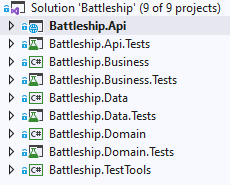
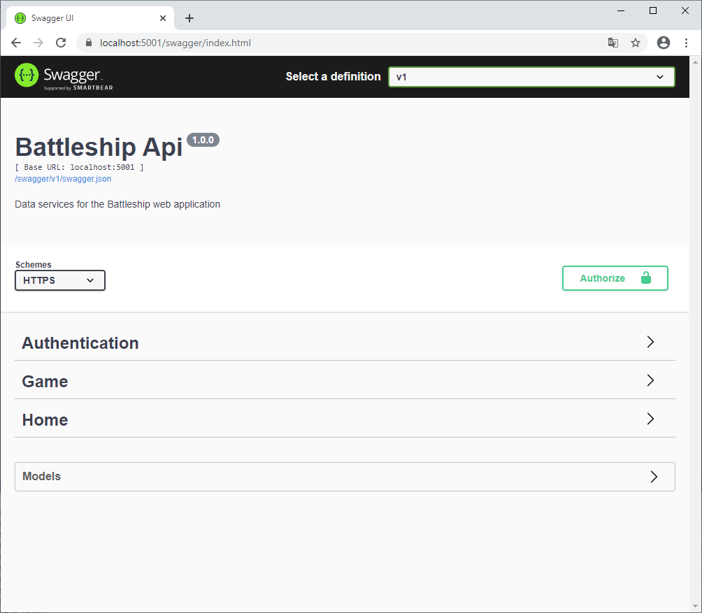

In de solution vind je 9 projecten:

* Battleship.Api -> Dit project is de eigenlijke webapplicatie. 
In de Controller folder vind je enkele classes die methoden bevatten die uitgevoerd worden als er een http request binnenkomt op een bepaalde url. 
Om de minimale vereisten te implementeren is het niet nodig om hier 1 letter code te wijzigen. 
Het gaat wel handig zijn om hier breakpoints te plaatsen om je applicatie te debuggen.
* Battleship.Api.Tests -> Bevat automatische testen voor de Controller classes in het Battleship.Api project. 
Deze testen zijn initieel allemaal groen. Aan jullie om dit zo te houden!
* Battleship.Business -> Bevat enkele service classes die gebruikt worden door de Controller classes in het Battleship.Api project. 
Hierin zal je enkele gaten moeten invullen.
* Battleship.Business.tests -> Bevat automatische testen voor de classes in het Battleship.Business project. 
Gebruik (naast de documentatie) deze testen om te achterhalen hoe je deze classes het best implementeert.
* Battleship.Data -> Bevat logica die toelaat om data op te slaan in een database of in geheugen. 
Voor deze applicatie worden gebruikers (spelers) opgeslagen in een database. 
Hiervoor moet je geen code schrijven. 
Ook is er een Repository class waarmee de lopende games in geheugen bijgehouden worden. 
Je hoeft geen code te wijzigen in deze class, maar het is niet slecht om de interne werking van _InMemoryGameRepository_ eens te bestuderen.
* Battleship.Data.tests -> Bevat automatische testen voor de classes in het Battleship.Data project. 
Jij moet enkel ervoor zorgen dat deze testen groen blijven.
* Battleship.Domain -> Bevat de domain classes. Deze classes proberen de logica van een zeeslag-spel te capteren. Hier zitten de grootste gaten die je zal moeten opvullen.
* Battleship.Domain.Tests -> Bevat automatische testen voor de classes in het Battleship.Domain project. 
Gebruik (naast de documentatie) deze testen om te achterhalen hoe je deze classes het best implementeert.
* Battleship.TestTools -> Bevat enkele classes die gebruikt worden door de testprojecten. Dit project mag je volledig negeren.

## Battleship.Api (Endpoints)

Als je de applicatie start, dan word je automatisch geleid naar https://localhost:5001/swagger/index.html. 

Hier vind je een uitleg over de verschillende http requesten die je kan sturen naar endpoints van de backend. 
_(Lees eerst even de documentatie over [client-server architectuur](Client-Server-architectuur) als je nog niet weet wat er met endpoints bedoeld wordt.)_
Je kan hier voor elke request zien welke parameters (json) er verwacht worden en welke responses je mag verwachten. Je kan zelfs de API aanspreken via deze user interface.



Wat misschien minder duidelijk is, is welke code er uitgevoerd wordt als er een http request aankomt op een eindpoint van de applicatie.
Hieronder vind je een overzicht van de methodes die worden uitgevoerd:

| Http request                                            | C# methode                | C# class                 | Omschrijving                                                                                                   |
| --------------------------------------------------------| ------------------------- | ------------------------ | -------------------------------------------------------------------------------------------------------------- |
| POST https://localhost:5001/api/authentication/register | Register                  | AuthenticationController | Nieuwe gebruiker registreren                                                                                   |
| POST https://localhost:5001/api/authentication/token    | CreateToken               | AuthenticationController | Een bearer token vragen                                                                                        |
| POST https://localhost:5001/api/games                   | CreateNewSinglePlayerGame | GamesController          | Een nieuw spel aanmaken                                                                                        |
| POST https://localhost:5001/api/games{id}/positionship  | PositionShipOnGrid        | GamesController          | Een ship plaatsen op je grid                                                                                   |
| POST https://localhost:5001/api/games/{id}/start        | StartGame                 | GamesController          | Een spel starten nadat de schepen geplaatst zijn                                                               |
| GET https://localhost:5001/api/games/{id}               | GetGameInfo               | GamesController          | Informatie over het huidige spel opvragen (= json versie van een _Battleship.Business.Models.GameInfo_ object) |
| POST https://localhost:5001/api/games{id}/shoot         | ShootAtOpponent           | GamesController          | Een bom schieten naar de tegenstander                                                                          |
| GET https://localhost:5001/api/home/ping                | Ping                      | HomeController           | Endpoint om te controleren of de applicatie nog draait                                                         |


De betekenis van elk end point wordt meer toegelicht in de commentaren die in de code staan. 
**Je hoeft (voor de minimale vereisten) geen code te wijzigen in dit project. 
Wel is het aan te raden om breakpoints te plaatsen in de methodes in bovenstaande tabel om zo all debuggend de flow van de code te analyseren.**

Voor de meeste end points moet de gebruiker zich authenticeren door een (bearer) token mee te sturen in de *Authorization* header van de http request. 
Dit token kan je verkrijgen via het end point *https://localhost:5001/api/authentication/token*. (dit kan je dus eventueel opvragen bij login)

De http header ziet er als volgt uit:
````
Authorization: Bearer {theToken}
````

## Battleship.Business

### GameService

In de _Services_ folder vind je de class _GameService_. Dit is de class die door de controller classes in het Api project gebruikt wordt om bewerkingen rond een spel (Game) te doen. 
De class coordineert de logica rond:
* het aanmaken van een Game en deze opslaan in het geheugen
* het starten van een Game
* het ophalen van de toestand van een _Game_ gezien door de ogen van een _Player_
* het positioneren van schepen
* het schieten naar de tegenstander

De _GameService_ class coördineert. Dat wil zeggen dat hij veel verantwoordelijkheid doorschuift naar andere classes (in het Battleship.Data project en Battleship.Domain project).
De _GameService_ doet alles met 3 instanties van objecten die worden doorgegeven via de constructor:
* een instantie van een class die _IGameFactory_ implementeert. 
Hiermee kan een _Game_ kan aangemaakt worden. 
De concrete instantie zal van het type _Battleship.Domain.GameDomain.GameFactory_ zijn.
* een instantie van een class die _IGameRepository_ implementeert. 
Hiermee kan een nieuw spel opgeslagen worden in het geheugen en terug opgehaalt worden. 
De concrete instantie zal van het type _Battleship.Data.Repositories.InMemoryGameRepository_ zijn.
* een instantie van een class die _IGameInfoFactory_ implementeert. 
Hiermee kan je de informatie over een _Game_ (_GameInfo_) in de ogen van een _Player_ construeren. 
Een player mag niet alle informatie van een _Game_ te zien krijgen (bijvoorbeeld de posities van de schepen van de tegenstander). 
Daarom wordt een _Game_ eerst omgezet naar een _GameInfo_ object vooraleer we het over het netwerk naar de speler sturen.

De gegeven code zorgt er al voor dat je juiste instanties van de juiste classes doorgegeven worden aan de constructor. 
Jij moet deze instanties nu nog correct gebruiken. Laat je leiden door de automatische testen...

### Factories

In de _Models_ folder vind je de _GameInfo_ class die gegevens over een _Game_ bevat door de bril van een _Player_.
_GameInfo_ bevat de volgende informatie:
* Id: unieke identifier (Guid) van de Game. **Zoek zelf eens op wat een Guid betekent en hoe je er mee werkt in C#.**
* IsReadyToStart: geeft aan of er gestart kan worden met schieten.
* HasBombsLoaded: geeft aan of de bom(men) van de _Player_ geladen zijn. Indien ja, dan kan hij schieten. Indien nee, dan is de tegenstander aan de beurt. 
* OwnGrid: informatie over de _Grid_ van de _Player_.
* OwnShips: informatie over de schpen van de _Player_.
* OpponentGrid: informatie over de _Grid_ van de tegenstander.
* SunkenOpponentShips: een lijst van de gezonken schepen van de tegenstander.

Aan de classes _GameInfo_, _GridInfo_ en _ShipInfo_ hoef je niets meer te doen.
Waar je wel nog aan moet werken zijn de bijhorende _Factory_ classes: _GameInfoFactory_, _GridInfoFactory_ en _ShipInfoFactory_. 
De factory classes bevatten de logica die nodig is om informatie over een _Game_ om te zetten naar informatie die een speler mag zien. 
Laat je leiden door de automatische testen...

## Battleship.Data

In dit project hoef je geen code te wijzigen, maar het is wel aangeraden om de class _InMemoryGameRepository_ in de _Repositories_ folder eens te bestuderen. 
In de _InMemoryGameRepository_ kan je zien hoe gedurende de levensduur van de web applicatie de verschillende games in geheugen worden bijgehouden. 

## Battleship.Domain

De classes in dit project proberen de logica van een zeeslag-spel te capteren. Het gaat hier om een heel aantal klassen. 
Daarom zijn ze ingedeeld in 4 subdomeinen:
* _GameDomain_: classes die een zeeslag spel helpen modeleren (_Game, GameFactory, GameMode, GameSettings_)
* _PlayerDomain_: classes die een speler modeleren (_HumanPlayer, ComputerPlayer, RandomShootingStrategy_)
* _GridDomain_: classes die een 10x10 grid modeleren (_Grid, GridCoordinate, GridSquare, GridSquareStatus_)
* _FleetDomain_: classes die de vloot van schepen van een speler modeleren (_Fleet, Ship, ShipKind_)

Er zijn ook enkele _hulp_ classes die niet tot een specifiek domein horen:
* User: een (menselijke) geregistreerde gebruiker. Je hoeft niets te wijzigen in deze code.
* DataNotFoundException: exceptie die gegooit wordt als er iets niet gevonden kan worden (bijvoorbeeld een _Game_ met een bepaalde id.)
* Direction: een class waarmee je vanalles kan doen met richtingen (noord, oost, zuid, west). 
Deze class krijg je volledig cadeau en zal zeker van pas komen (bijvoorbeeld bij het willekeurig plaatsen van de schepen van een computerspeler). 
Bestudeer deze class dan ook goed zodat je weet wanneer je hem zou kunnen gebruiken. 
* Result: een class waarmee je een resultaat kan terug geven die een reden bevat als het is mis gegegaan. Ook deze code krijg je cadeau. 
* ShotResult: een class die het resultaat bevat van een shot op de _Grid_ van de tegenstander. Ook deze code krijg je cadeau.

### Waar beginnen in het Domain project?

In het domain project zijn veel classes aanwezig. Waar moet je nu beginnen? 

* Werk **feature per feature**. Laat ons hier het voorbeeld "Een nieuw spel starten" nemen. 
     * **Traceer de flow van de code** vanuit het API project. Plaats een breakpoint in de juiste controller methode en gebruik **debugging** technieken om dieper en dieper in de code te stappen. Voor het starten van een nieuw spel plaats je een breakpoint in de _CreateNewSinglePlayerGame_ methode.
     * Vervolledig de methodes / properties die je tegen komt tijdens het debuggen. **Laat je leiden door de automatische testen**. **Methodes en properties die je niet nodig hebt voor de huidige feature laat je voorlopig links liggen**. Bij het aanmaken van een nieuw spel zal je de _CreateGameForUser_ methode van de _GameService_ moeten implementeren. Vervolgens zal je merken dat je de _CreateNewSinglePlayerGame_ methode van _GameFactory_ zal moeten implementeren en de _CreateFromGame_ methode van de _GameInfoFactory_ class, enzovoort.
     * Als de automatische testen aangeven dat een bepaalde methode / property van een andere class nog niet geïmplementeerd is dan implementeer je die eerst.
* **Zorg dat je de gegeven code ook begrijpt**. Neem de tijd om de achterliggende theorie te bestuderen. Als je weet wat je aan het doen bent dan zal je code veel beter zijn en zal het ook aangenamer zijn om te programmeren. 
     * Als er in een class parameter van een interface type wordt doorgegeven in een constructor, dan ga je ook de class die de interface implementeert moeten aanvullen om de feature aan het werken te krijgen. Tip: als je rechts klikt op een interface type en je selecteert _Go to implementation_ dan kom je uit op de class die de interface implementeert.


### GridCoordinateArrayExtensions

Om het plaatsen van schepen te vereenvoudigen maak je gebruik van _extensies_ op een array van grid coördinaten (_GridCoordinate[]_).
Deze extensies moet je zelf nog invullen in de _GridCoordinateArrayExtensions_ class. 
Om goed te weten wat je in deze class moet doen en hoe je de methoden in deze class kan gebruiken, ga je eens moeten onderzoeken wat **_extension methods_** in C# zijn. 
Op https://www.tutorialsteacher.com/csharp/csharp-extension-method vind je een vrij heldere uitleg, maar niets houd je tegen om ook andere bronnen te raadplegen.

### Shooting strategies

Als een computerspeler aan zet is, dan moet hij bepalen op welk vak van de tegenstander hij gaat schieten.
Dit doe je door een class te maken die de interface _IShootingStrategy_ implementeert. 
Voor de minimale vereisten is dat de class _RandomShootingStrategy_. 

Bij de **_RandomShootingStrategy_** wordt er geschoten op een willekeurig vak van de tegenstander. 
Er wordt enkel geschoten op vakken waarop nog niet geschoten was. 
Met het resultaat (ship geraakt of niet?) wordt in deze strategie geen rekening gehouden.

Wil je een slimmere computerspeler bouwen (als extra) dan implementeer je de class **_SmartShootingStrategy_**. 
Deze strategie onthoudt wanneer er een schip geraakt wordt en gaat proberen dat schip snel te zinken door de volgende keer in de buurt te schieten. 
De strategie is ook slim genoeg om te weten in welke richting een schip (waarschijnlijk) ligt als er 2 geraakte vakjes naast elkaar liggen.

In de _GameFactory_ class kan je bepalen welke shooting strategy je meegeeft aan een computerspeler.